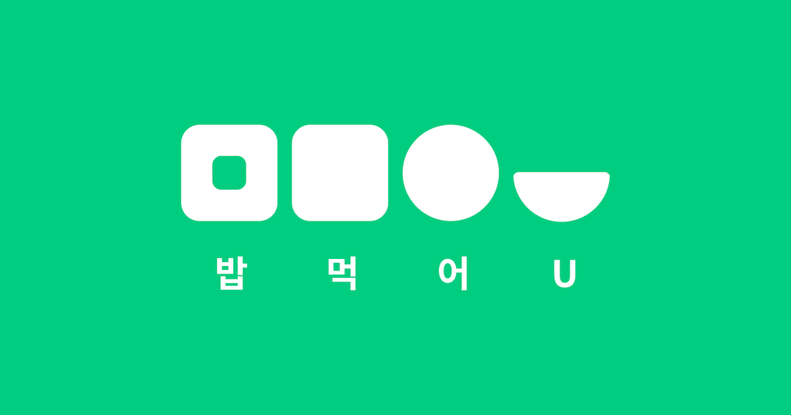

# 밥먹어U


UNIST 구내식당 식단표 뷰어

[](https://apps.apple.com/kr/app/%EB%B0%A5%EB%A8%B9%EC%96%B4u/id1628256171)
[](https://play.google.com/store/apps/details?id=com.wjddnwls7879.unistbab)
[](https://bapu.hexa.pro)

[](LICENSE)
[](https://flutter.dev)

## 주요 기능

| 기능 | Android | iOS | Web |
| --- | :---: | :---: | :---: |
| 주간 식단 조회 | ✅ | ✅ | ✅ |
| 다음 주 식단 미리보기 | ✅ | ✅ | ✅ |
| 식당 운영시간 확인 | ✅ | ✅ | ✅ |
| 영어 지원 | ✅ | ✅ | ✅ |
| 다크모드 지원 | ✅ | ✅ | ✅ |
| 식단 카드 길게 눌러 메뉴 공유 | ✅ | ✅ | ⛔ |
| 식단 알림 | ✅ | ✅ | ⛔ |
| 홈 화면 식단 위젯 | ✅ | ✅ | ⛔ |
| 알레르기 유발식품 경고 | 🟡 | 🟡 | ⛔ |

| 표시 | 의미 |
| --- | --- |
| ✅ | 현재 지원 (Supported) |
| 🟡 | 구현 예정 (Not implemented yet; planned) |
| ⛔ | 구현 계획 없음 (Will not be implemented) |

## Getting Started

1. [Flutter 설치 안내](https://docs.flutter.dev/install/quick)에 따라 SDK를 설치하세요. [pubspec.yaml](pubspec.yaml)이 요구하는 Flutter 버전을 사용해야 합니다.

2. 저장소를 복제한 뒤, 원하는 플랫폼에서 앱을 실행하거나 빌드하세요. iOS 앱을 실행하거나 빌드하려면 macOS와 Xcode가 필요합니다.

```bash
git clone https://github.com/HeXA-UNIST/meal_client.git
cd meal_client
flutter pub get
flutter run
```

### Test

Flutter 코드를 분석하고 테스트하려면 다음 명령을 실행하세요.

```bash
flutter analyze
flutter test
```

Android 앱을 한 번 실행하거나 빌드하여 Gradle Wrapper를 준비한 뒤, 다음 명령으로 네이티브 단위 테스트를 실행하세요.

```bash
./android/gradlew -p android :app:testDebugUnitTest
```

Windows에서는 `./android/gradlew` 대신 `.\android\gradlew.bat`을 사용하세요.

iOS 네이티브 테스트는 macOS에서 사용 가능한 시뮬레이터를 확인하고, `SIMULATOR_UDID`를 사용할 시뮬레이터의 UDID로 바꿔서 실행하세요.

```bash
xcrun simctl list devices available
xcodebuild test -workspace ios/Runner.xcworkspace -scheme Runner -destination 'platform=iOS Simulator,id=SIMULATOR_UDID'
```

## Architecture

- `AppSettings`는 앱 설정을 관리하고 설정값을 `shared_preferences`에 저장합니다.
- `/v2/menu`에서 식단을, `/v2/info`에서 최신 식당 운영 시간과 공지를 가져옵니다.
  - Android와 iOS 앱은 받은 JSON을 캐시에 저장해 홈 화면 위젯과 공유합니다.
  - 요청을 보내기 전 유효한 캐시가 있으면 해당 데이터를 먼저 표시하고, 최신 응답을 받으면 화면을 갱신합니다.
  - 웹에서는 캐싱을 사용하지 않습니다.
  - `/v2/menu`에서 다음 주 시작일을 제공할 경우(=다음 주 식단이 업로드되었다는 의미) 앱은 다음 주 식단을 가져와 표시합니다.
- Android와 iOS 앱은 `workmanager`를 통해 백그라운드 데이터 갱신 작업을 등록하고, 사용자 설정과 식단 캐시를 바탕으로 로컬에서 식단 알림을 예약합니다.

### Directory Structure

```text
meal_client/
├── lib/
│   ├── main.dart                 # 앱 시작점과 테마
│   ├── core/                     # API, 네트워크, 공유 저장소
│   ├── domain/                   # 식단 데이터 모델
│   ├── features/
│   │   ├── home/                 # 주간 식단 메인 화면
│   │   ├── meal/                 # 식단 요청과 캐시
│   │   ├── info/                 # 공지/운영시간 요청과 캐시
│   │   ├── settings/             # 앱 설정 화면
│   │   ├── notification/         # 식단 알림 예약
│   │   └── widget/               # 홈 화면 위젯
│   └── l10n/                     # 한국어/영어 번역
├── android/                      # Android 앱, 홈 화면 위젯
├── ios/                          # iOS 앱, WidgetKit 위젯
├── plugins/
│   └── bapu_widget_bridge/       # Android 위젯 렌더링 브리지
└── web/                          # 웹 앱 리소스
```

### Tech Stack

- **State Management:** `provider`
- **Network:** `http`, Android `cronet_http`, iOS `cupertino_http`
- **Local Storage:** `shared_preferences`, `path_provider`
- **Notification & Background task:** `flutter_local_notifications`, `timezone`, `workmanager`
- **Home Widget:** Android `bapu_widget_bridge`, iOS WidgetKit
- **Localization:** `flutter_localizations`, `intl`
- **Share API:** `share_plus`

## 오픈소스 라이선스

이 프로젝트는 [GNU General Public License v2.0](LICENSE)에 따라 배포됩니다.

Copyright © 2024-2026 HeXA.
